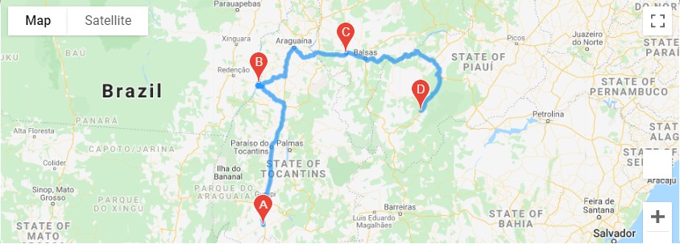

# World_Weather_Analysis

### Have fun with API calls to retrieve current weather data and vacation destinations from around the world!

- #### WeatherPy.ipynb:

Use WeatherPy.ipynb to generate a set of random latitude and longitude combinations. From each  set of random latitude and longitude pairs, the nearest city will be located and an API call will be made to retrieve the current weather data in that city. View the output cities and weather conditions in the cities.csv file under the weather_data folder. 

WeatherPy.ipynb will also take a look into how latitude and longitude affect the weather conditions. View Fig.1 - Fig.4 in weather_data to take a look at the results. 

- #### VacationPy.ipynb

VacationPy.ipynb takes a closer look at the cities from the cities.csv file. For a more visual look at the weather data, heatmaps of the following are generated: temperature, percent humidity, percent cloudiness, and wind speed. 

If you are in the mood for a vacation, input the maximum and minimum temperatures that you prefer and cities to visit will be suggested for you. Need more help with deciding where to go? Hotel names closest to the city you are visiting will be suggested for you. Take a look at the hotel name, city, country, and maximum temperature by clicking on the marker of a place you might want to visit. 

- #### Weather_Database.ipynb

If you're looking for additional weather information, use Weather_Database.ipynb! In addition to the maximum temperature, humidity, cloudiness, and wind speed, you can also view the current weather description, rainfall and snowfall. Take a look at the output in the WeatherPy_database.csv under the weather_data folder. 

- #### Vacation_Search.ipynb

Do you dislike rain, but like the snow? Use Vacation_Search to narrow down your vacation selection. Vacation_Search will narrow down your city destination options from the Weather_Database by asking you your temparture, rain, and snow preferences. Need help aslo finding a hotel? No worries, a hotel closest to each city will be provided for you too. 

- #### Vacation_Itinerary.ipynb

Use Vacation_Itinerary to finally plan your trip! Based on your previous preferences, choose a country and four city destinations you wish to visit. Not only will the driving directions from one city to the next be provided for you, but also the hotel in each city. Curious what the current weather is like? Just click on the marker. 

Personally, I chose to plan a trip driving around Brazil. I will start my vacation in Alvorada and end in Bom Jesus. Along the way, I will also be stopping in Conceicao Do Araguaia and then Riachao. 

Feel free to take a look at my vacation plans!

